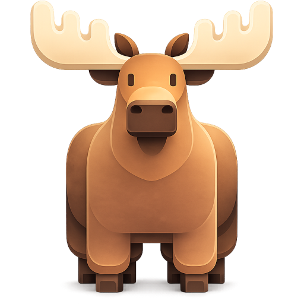

<p align="center">
  
</p>

<h1 align="center">Moose</h1>

<p align="center">A simple home for your AI chats on Linux.</p>

Moose lets you chat with local AI models or an optional cloud provider in a native
GTK and libadwaita app. Download a local model, ask a question, or bring your own
files into the conversation.
Your chats and drafts are saved on your computer, so you can pick up where you left off.


## Install

[Get Moose on Flathub](https://flathub.org/apps/io.github.moooossee.Moose),
or install it from your terminal:

```sh
flatpak install flathub io.github.moooossee.Moose
```

## What you can do

- **Manage your models.** Browse and download models without leaving the app.
- **Chat with your files.** Attach images, PDFs, text files, Markdown, or code.
- **Keep a document library.** Search your documents and use them in conversations.
- **Read answers clearly.** View formatted code, math formulas, and model reasoning.
- **Rework a conversation.** Edit a message, retry an answer, or continue from an earlier message while keeping previous versions.
- **Come back later.** Drafts save automatically, and you can export your chats whenever you need them.
- **Choose your connection.** Use Ollama managed by Moose, an existing Ollama instance,
  Ollama Cloud, Groq, OpenAI, Anthropic Claude, or Google Gemini.
- **Protect your API keys.** Save cloud credentials securely in your desktop keyring.
- **Control what you share.** Local Only mode blocks remote inference, and remote
  chats ask permission before sharing messages or files.


## Getting started

Open Moose and follow the setup steps. The Flatpak version can install and manage
Ollama for you. Choose a model, download it, and start chatting.

To ask about a file, use the attachment button, drop it into the chat, or paste a
screenshot. Images need a model with vision support. PDFs need selectable text;
scanned pages are not read automatically.

Chats and your document library are stored on your computer. Local model inference
uses Ollama managed by Moose. Cloud and external Ollama requests send the approved
conversation context to the selected provider.

## Build and run

### Flatpak

With Flatpak Builder installed and the Flathub remote added, run these commands
from the project folder:

```sh
flatpak run org.flatpak.Builder --user --install --install-deps-from=flathub --force-clean builddir io.github.moooossee.Moose.yml
flatpak run io.github.moooossee.Moose
```

### Native build

You will need Rust, Meson, GTK 4, libadwaita, GtkSourceView 5, SQLite with FTS5,
and Poppler's `pdftotext` tool.

```sh
meson setup builddir-native -Dgui=true
meson compile -C builddir-native
```

## License

Moose is free software, released under [GPL-3.0-or-later](LICENSE).
